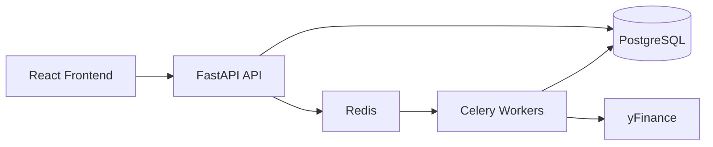
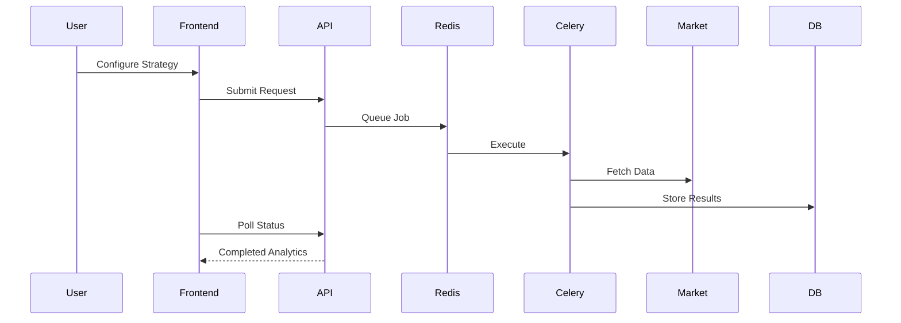

# 📈 Equity Backtesting Platform

<div align="center">

### Production-Grade Quantitative Equity Research & Backtesting Platform

Design, test, and analyze factor-based investment strategies on the Indian stock market using historical price and fundamental data.

**Live Demo:** https://equity-backtesting-platform.vercel.app/

---


</div>

---

> **Complete workflow:** Login → Configure Strategy → Run Backtest → View Analytics → Export Results
>
> ### Demo Credentials

| Field | Value |
|-------|-------|
| Email | demo@example.com |
| Password | demo1234 |

---

## 🚀 Overview

Equity Backtesting Platform is a production-ready full-stack application built for quantitative equity research on the Indian stock market.

Instead of being a simple CRUD dashboard, the platform simulates historical investment strategies using fundamental filters, ranking models, portfolio construction logic, and benchmark comparison while leveraging asynchronous background processing for scalability.

It demonstrates modern software engineering practices including production deployment, authentication, background workers, Dockerized infrastructure, CI/CD, monitoring, and cloud hosting.

---

## ✨ Highlights

- Production deployment (Vercel + Railway)
- FastAPI REST API
- React + Vite frontend
- PostgreSQL database
- Redis caching & broker
- Celery asynchronous workers
- JWT Authentication
- Role-Based Access Control
- Dockerized services
- CI/CD with GitHub Actions
- Interactive portfolio analytics
- CSV & Excel export
- Strategy scheduling & alerts

---

## 🏗️ Architecture



------------------------------------------------------------------------

# 🔄 Backtesting Workflow



------------------------------------------------------------------------

## ✨ Features

### Quantitative Research

- Multi-factor ranking
- Fundamental screening
- Portfolio sizing
- Historical simulations
- Benchmark comparison
- Rebalancing engine
- Commission modelling
- Slippage modelling

### Analytics

- CAGR
- Sharpe Ratio
- Sortino Ratio
- Calmar Ratio
- Maximum Drawdown
- Alpha
- Equity Curve
- Portfolio Logs
- Winners & Losers
- Export to CSV & Excel

### Platform Features

- JWT Authentication
- Role-based access
- Scheduled strategies
- Email notifications
- Background processing
- REST APIs
- Swagger documentation
- Health checks

---

## ⚙️ Tech Stack

### Frontend

- React 18
- Vite
- Tailwind CSS
- Recharts
- Axios

### Backend

- FastAPI
- SQLAlchemy
- Alembic
- Celery
- Redis
- PostgreSQL

### DevOps

- Docker
- GitHub Actions
- Railway
- Vercel
- Gunicorn
- Nginx

---

## 📂 Project Structure

```text
backend/
frontend/
docker-compose.yml
docker-compose.prod.yml
.github/
scripts/
```

---

## 🚀 Local Setup

```bash
git clone <repo-url>

cd equity-backtesting-platform

cp .env.example .env

docker compose up --build
```

Frontend

```
http://localhost:5174
```

Backend

```
http://localhost:8000
```

Swagger

```
http://localhost:8000/docs
```

---

## 🐳 Docker

```bash
docker compose up --build
```

Production

```bash
docker compose -f docker-compose.yml -f docker-compose.prod.yml up -d
```

---

## ☁️ Production Deployment

| Service | Platform |
|---------|----------|
| Frontend | Vercel |
| Backend | Railway |
| Database | PostgreSQL |
| Queue | Redis |
| Workers | Celery |

---

## 📊 API Documentation

Swagger UI

```
/docs
```

OpenAPI

```
/openapi.json
```

---

## 🧪 Testing

Backend

```bash
pytest
```

Frontend

```bash
npm test
```

---

## 📈 Performance

- Async background execution
- Redis caching
- Connection pooling
- Docker containers
- Production-ready deployment
- Structured logging
- Horizontal worker scaling

---

# 📸 Screenshots

## Dashboard


---

## Running a Backtest


---

## Saved Strategies


---

## Data Management


---

## Your Profile


---

## User Admin


---

## 🗺️ Roadmap

- ✅ Async Backtesting
- ✅ Portfolio Analytics
- ✅ Docker Deployment
- ✅ Production Hosting
- ✅ Strategy Alerts
- ⏳ Machine Learning Models
- ⏳ Live Market Data
- ⏳ Portfolio Optimizer
- ⏳ Broker Integration

---

## 🤝 Contributing

Contributions, feature requests, and bug reports are welcome.

Fork → Branch → Commit → Pull Request

---

## 📜 License

MIT

---

## 👨‍💻 Author

**Hitesh Girish Shibag**

If you found this project useful, consider giving it a ⭐ on GitHub.
